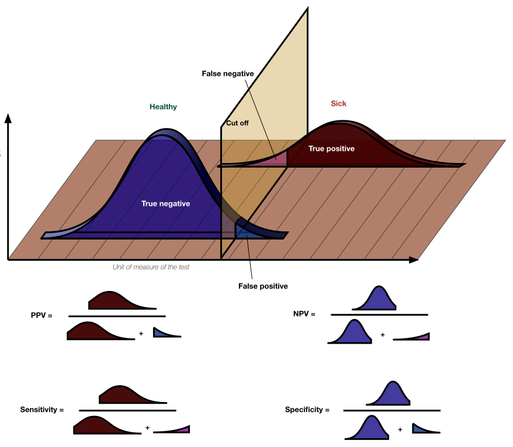

==============
Fuzzy checking
==============

It is more difficult to check that a value is correct when the value in the
simulation is subject to stochastic variation.
For example, the mean value of a continuous risk factor will never **exactly** match the GBD value.
The difficulty of this problem is part of why, in the manual V&V process, we usually check such values visually.

Note that fuzzy checking can be applied to both **verification** and **validation**.
For verification, the "target" is that the simulation's value is exactly
correct *with a large enough simulated population*.
For example, if the simulation applies a GBD incidence rate,
then with enough simulants, the simulation should match the GBD rate to many decimal points.
For validation, we specify as a target a 95% uncertainty interval (UI), within which we expect the simulation's **underlying** value (i.e. the value of the simulation result as the simulated population size goes to infinity) should fall 95% of the time.
For example, we could specify that the UI of the simulation's prevalence value is +/-10% of the GBD prevalence, which means it should be 95% certain to be within 10% of GBD **as the simulated population size goes to infinity.**
For more on how to set this UI, see the next sections.

We have formalized fuzzy checking using Bayesian hypothesis tests,
with one test for each of the values to check in the simulation.
In these hypothesis tests, one hypothesis is that the simulation value comes from the target distribution
and the other hypothesis is that it comes from a prior distribution of bugs/issues;
when our data strongly favors the latter, it indicates a problem with the simulation.

V&V as a decision problem
-------------------------

The purpose of V&V is to inform the decision of whether to move forward with a simulation as-is,
(e.g., to report its results in a scholarly publication) or investigate the cause of a surprising result.
A surprising result may be valid, or it may be caused by a bug or limitation in the simulation.
Investigating will make us more confident which it is, but it costs us time.

Publishing/using a result is good if the result is accurate, but bad if the result is inaccurate.
How good and how bad these outcomes are, in relation to the cost of investigation and bug-fixing,
depends on the context but is key to making the right V&V decision.

Typically fixing *bugs* (issues caused by differences between documentation and implementation) is
always considered worth the time it takes, which is relatively little
because it does not require redesigning the model or seeking more data.

*Limitations*, on the other hand, are when the documentation was implemented correctly but doesn't
match the real world or expectation.
These are sometimes difficult enough to address and/or have minimal enough
impact on results that we don't fix them even when they are known.
We call such limitations "acceptable."
Some acceptable limitations are known before we even build the model, and we'll call these "planned" limitations.
However, if we failed to accurately anticipate the impact of a planned limitation on our results, that constitutes an additional unplanned
limitation that, when we discover it, we may deem acceptable or unacceptable.

Finding an unplanned but acceptable limitation has some benefit, in that we understand the simulation better, even though we won't change it.
In contexts where this benefit is less than the cost of investigation,
doing an investigation and finding an acceptable limitation is an overall negative,
whereas in other contexts it is worth it.
This impacts how we define our hypotheses, as discussed in the next session.
Furthermore, it may be the case that only *some* unplanned acceptable limitations are worth it to us to know about:
for example, only the unplanned acceptable limitations that are larger than the unplanned limitations we typically
produce in simulation design.

Defining the hypotheses
-----------------------

Our hypotheses are about the simulation **process**, which includes everything starting from primary data collection in the real world,
to data seeking and interpretation, to the modeling itself (since bugs or limitations could be introduced anywhere in this chain).

Our hypotheses are more precisely defined based on the bugs and limitations *that are worth the cost of investigation
to know about*, as discussed in the previous section.
Our "no bug/issue" hypothesis is a distribution representing our subjective belief about the results
that would be generated by a simulation process without any such bugs or limitations.
The "bug/issue" hypothesis is just the opposite: our belief about the results that would be generated
by a simulation process with such bugs or limitations.

Sources of uncertainty
----------------------

For validation (but not verification) fuzzy checks, we will specify uncertainty in our "no bug/issue" hypothesis.
Conceptually, we should only include uncertainty due to parts of the validation data generation process
that are not shared with simulation input data.
We should never include uncertainty due to stochastic
variation in the simulation, as that will be handled by the hypothesis test itself.

For example, if we validate a simulation value against an estimate from a survey that we didn't use to inform
the simulation, those values could be different due to sampling error (including non-response bias) in
the survey, in addition to simulation limitations minor enough that we don't care to investigate them (see previous section).

On the other hand, if we validate a population-level simulation value against an estimate from a survey,
when we used that same survey to inform demographic-specific values for input to the simulation,
the sampling error is shared.
The only reason the simulation value would be different from the survey value is if the demographic
structure of the population is different in the simulation, so we should think about how much we'd
expect it to differ (accounting for data limitations and "minor" simulation limitations in our demographic components)
and set our target uncertainty based only on that.

It will probably not be feasible to do this whole process quantitatively, but understanding
which sources of uncertainty should be included will help us estimate our subjective uncertainty.
Additionally, in practice we do not actually specify an arbitrary distribution for our belief,
but rather a 95% uncertainty interval (UI).
For computational reasons, the distribution actually used is the one closest to replicating that
95% UI from a family pre-selected based on the quantity type (e.g. beta distribution for a proportion).
This is a common limitation in Bayesian hypothesis testing. [Bernardo_2002]_

.. note::
  We treat the 95% UIs as equal-tailed intervals; in other words, we treat the
  lower bound as the 2.5th percentile and the upper bound as the 97.5th.

Choosing the cutoff and population size
---------------------------------------

We choose a cutoff `Bayes factor <https://en.wikipedia.org/wiki/Bayes_factor>`_
for each check.
The Bayes factor represents the size of the Bayesian *update* we would make toward
the hypothesis that there is an bug/issue in the simulation.
If this number is greater than our cutoff, the check "fails" and we investigate why the result
is so far from the target.

Increasing the cutoff trades sensitivity for specificity.
The **sensitivity** of a check is the probability of it catching
an issue, given that the issue is present.
The **specificity** is the probability of the check passing when
there is no issue present.
The appropriate tradeoff depends on the cost of investigation (which is wasted by a false alarm)
vs the cost of moving forward with inaccurate results (which is risked by an issue not being flagged).

Increasing the population size trades computational resources for both sensitivity **and** specificity.
A larger population size gives us better power to detect bugs and makes false alarms less likely, at
every cutoff.

Currently, we do not explicitly specify what our sensitivity and specificity values should be.
Instead, we use a conventional "decisive" value of 100 for our Bayes factor cutoff, and set the population
to be as large as we can reasonably run.
We might revisit how to set these values in the future.

You can picture the tradeoffs visually using
this diagram `from Wikipedia <https://en.wikipedia.org/wiki/Sensitivity_and_specificity>`_.

  By Original by Luigi Albert Maria - SVG version of File\:PPV, NPV, Sensitivity and Specificity.pdf, CC BY-SA 4.0, https://commons.wikimedia.org/w/index.php?curid=99283192

The yellow plane represents the cutoff: to the left of this boundary, our check
considers the simulation "Healthy"; to the right, our check
considers the simulation "Sick."

Increasing population size increases both sensitivity and specificity at every cutoff
by making both the blue and red distributions narrower.
Increasing the cutoff increases specificity by cutting off less of the blue distribution
but decreases sensitivity by cutting off more of the red distribution.

In non-fuzzy V&V checks, all "healthy" simulations appear the same, so the blue distribution would be a point mass.
As a result, there are no false alarms, and the specificity is always perfect.
The sensitivity depends on the population size: with a very small simulation run,
there could be lots of buggy situations that are possible but don't occur in that run due to chance.
Fuzzy checking introduces the problem of false alarms ("false positives" in the diagram above), when a check fails randomly without
there being an actual problem in the simulation.

Hypotheses by quantity type
---------------------------

.. todo::
  We have implemented methods for fuzzy checking proportions and means of
  continuous values. Other types of values could be checked using appropriate
  hypothesis tests:

  * Other summary statistics of continuous values, such as the standard deviation of a hemoglobin distribution
  * Relative risks/rate ratios between categorical groups
  * More complex situations such as the number of unique values of an attribute observed, though these may
    be hard to work out hypotheses for, and are not likely to come up frequently in our simulations.

Proportions
+++++++++++

In our discrete-time simulations, on each time step,
a given event happens to some *proportion* of the population at risk.

The proportion we observe in the simulation is the result of some number of independent Bernoulli trials,
one for each simulant at risk.
When the probability of the event is the same for each simulant, the number of events has a binomial distribution.

When simulant-level probabilities vary (for example, if there is a risk factor affecting the probability)
the Bernoulli trials are independent but not identically distributed,
**if we take into account our prior knowledge about the risk factor.**
In that case, the number of events observed has a `Poisson binomial <https://en.wikipedia.org/wiki/Poisson_binomial_distribution>`_
distribution, which has the same mean and **lower** variance than the equal-probability binomial.
Generally, it will be easier for us to ignore our prior knowledge about varying probabilities, and use the binomial distribution.
This sacrifices some sensitivity without a corresponding increase in specificity, because we will
not flag an issue where the result is only very unlikely **given the observed distribution of risk factors.**

When a target 95% UI is specified instead of a single target value,
we fit a `beta distribution <https://en.wikipedia.org/wiki/Beta_distribution>`_ that has approximately that UI.
The lower and upper bounds must both in the interval :math:`(0, 1)`.
Because the beta distribution is the conjugate of the binomial distribution,
we can then use an easy-to-calculate `beta-binomial <https://en.wikipedia.org/wiki/Beta-binomial_distribution>`_ as the distribution
of the number of events.

Finally, we must specify a distribution in the case where there is a bug/error
in the simulation.
For simplicity, we default to a `Jeffreys prior <https://en.wikipedia.org/wiki/Jeffreys_prior>`_ on the probability --
a beta distribution with :math:`\alpha = \beta = 0.5` --
which results in a beta-binomial distribution on the number of events.

Means of continuous values
++++++++++++++++++++++++++

Continuous values (real numbers) show up in our simulations in a number of places.
For example, certain risk factors (e.g. hemoglobin) have continuous exposures.
Additionally, many intermediates in simulation computations are continuous values.
For example, even though mortality can be seen as a binary event and dealt with as a proportion,
more statistical power can be gained (at the expense of not testing that the sampling step is
working appropriately) by checking the underlying *probability* of mortality, which is real-valued.

We assume that each simulant's continuous value was independently drawn from a normal distribution
with unknown mean and variance.
(When the draws are not in fact identically distributed, we will ignore our knowledge of this, as in
the proportions case.)
``FuzzyChecker.assert_mean`` offers two constructions of
the Bayes factor, selected by its ``method`` parameter.

The default, ``method="conjugate"``, mirrors the proportions machinery.
The variance gets a weakly informative :math:`\Gamma^{-1}(2, s^2)` prior, where :math:`\Gamma^{-1}`
refers to `the inverse-gamma distribution <https://en.wikipedia.org/wiki/Inverse-gamma_distribution>`_.
This family is used because there is no proper Jeffreys prior for this unbounded parameter,
and setting the scale from the data is much less informative than heuristics
such as setting both parameters to nearly zero. [Gelman_2006]_
The scale :math:`s` defaults to the *observed* standard deviation -- an empirical-Bayes choice.
Deriving it from the target instead (as an early version did) silently costs the test its power
whenever the data's spread is much smaller than its mean, which is the common case.
The no-bug/issue model fixes the mean at the target value; a target 95% UI instead becomes
a fixed normal prior on the mean, in data units, independent of the variance prior.
The bug/issue model's mean prior is nearly data-free: it carries a weight of
:math:`\lambda_0 = 10^{-3}` pseudo-observations, expressed as a very wide uncertainty interval
centered on the target (roughly :math:`\pm 62` observed standard deviations at the default priors),
which can be customized more interpretably than :math:`\lambda_0` itself.
Because the priors are conjugate, the Bayes factor is a ratio of closed-form marginal likelihoods.

The alternative, ``method="fractional"``, is `O'Hagan's fractional Bayes factor <https://doi.org/10.1111/j.2517-6161.1995.tb02017.x>`_
with reference priors. [OHagan_1995]_
A fraction of the likelihood (``training_fraction``, default the minimal :math:`2/n`) trains the
priors and the remainder tests, so the improper priors' arbitrary constants cancel and **no prior
hyperparameters exist at all**.
This avoids the empirical-Bayes caveat of the conjugate defaults (the data setting its own prior
scale) at a cost in small samples: evidence *for* the null accumulates more slowly, so correct
data at :math:`n \lesssim` a few hundred often lands in the inconclusive warning band rather
than a conclusive pass.
Both methods are calibrated (essentially zero false decisive failures on correct data) with power
that depends only on the size of the bias and the sample size.

The zeroth, first, and second moments of the continuous values are sufficient statistics, so
either the moments or the values themselves can be passed in, whichever is more convenient.
When accumulating moments while streaming over a large population, accumulate them for
:math:`y - c` for any constant :math:`c` near the data -- the target mean is a natural choice --
and pass :math:`c` as ``moments_center``: a raw sum of squares of values far from zero loses the
spread to floating point cancellation, and a warning fires when the supplied moments look
corrupted by it.

Two caveats on the normality assumption.
Realistic departures -- skewed, zero-inflated, or heavy-tailed values -- cost essentially nothing:
calibration and power match the normal case.
*Extremely* skewed values (skewness in the hundreds) at small :math:`n` bias the test toward
**false alarms** (never silent passes); for such quantities, check the mean of the log values or a
quantile instead, or use more simulants.
Bounded values such as probabilities can be checked as if unbounded, at some cost in sensitivity
and specificity.

.. note::

  It would be interesting to explore using a transformation function on bounded values, such as logit
  for probabilities, before performing the fuzzy check as if they were unbounded continuous values.
  The main difficulty here would be dealing with values exactly at the boundary.

References
----------

.. [Bernardo_2002] Bernardo, José M., and Raúl Rueda. “Bayesian Hypothesis Testing: A Reference Approach.” International Statistical Review / Revue Internationale de Statistique, vol. 70, no. 3, 2002, pp. 351–72. JSTOR, https://doi.org/10.2307/1403862. Accessed 6 Nov. 2023.

.. [Gelman_2006] Gelman, Andrew. "Prior distributions for variance parameters in hierarchical models (comment on article by Browne and Draper)." (2006): 515-534. https://sites.stat.columbia.edu/gelman/research/published/taumain.pdf

.. [OHagan_1995] O'Hagan, Anthony. "Fractional Bayes factors for model comparison." Journal of the Royal Statistical Society: Series B (Methodological) 57.1 (1995): 99-118.
